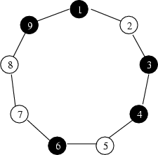
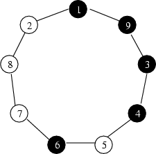
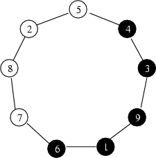

# Bianco e nero #

Questo problema dimostrativo è una riesposizione del problema "bianco e nero" delle OII 2002.

Trovi [versione originale](http://turingarena.org "versione originale del testo del problema bianco e nero nell'archivio valcon")
del testo nell'[versione originale](http://turingarena.org "archivio valcon, contiene molti materiali didattici relativi alla olimpiadi ed alla programmazione in generale. Visita consigliata.")
oppure a [questo link interno](public/bianco-e-nero_testo-originale.html "copia in locale del testo originale del problema bianco e nero").

Un modo in cui la presente versione TuringArena si pone l'obiettivo di impreziosire il problema, oltre al maggior feedback ed alla resa interattiva, risiede nella formulazione e proposta di un percorso per goals che quidano il problem-solver a ricercare la comprensione prima della codifica.

## Goals ##

Progetta e realizza algoritmi per:

1. Data una collana, dire quale è il minimo numero di mosse per risolverla;

2. Fornire una qualsiasi sequenza di mosse che la risolva;

3. Fornire una sequenza risolvente ottima, ossia che contempli il minor numero possibile di mosse;

4. Fare quanto richiesto in tempo lineare nella lunghezza della collana.

## DESCRIZIONE DEL PROBLEMA ##

Vi viene data una collana costituita da&nbsp;$N$ perline bianche e nere. Ogni perlina porta impresso un numero intero da&nbsp;$1$ a&nbsp;$N$; all'inizio, leggendo i numeri delle perline in senso orario, essi compaiono consecutivamente, cioè la perlina&nbsp;$1$ è seguita dalla perlina&nbsp;$2$, che è seguita dalla perlina&nbsp;$3$ eccetera. (Naturalmente, la perlina&nbsp;$N$ è seguita dalla perlina&nbsp;$1$).

Un esempio di collana è mostrato in Figura&nbsp;$1$.

Il vostro obiettivo è di riordinare le perline in modo tale che alla fine le perline dello stesso colore compaiano consecutivamente, cioè tutte le perline bianche compaiano senza interruzioni, e così pure le perline nere.
Non è importante invece quale sia l'ordine numerico delle perline alla fine.

Per riordinare le perline avete a disposizione un solo tipo di operazione, detto taglia e cuci.
Questa operazione consiste nel tagliare un segmento della collana e nel reincollarlo nella stessa posizione ma in senso inverso.

Con un'ulteriore operazione di taglia e cuci riusciamo ora ad ottenenere la seguente configurazione che consideriamo risolta in quanto tutte le perle di uno stesso colore sono disposte consecutivamente lungo la collana.

# INTERFACE (gestione input/output) #

Per quanto riguarda la presente versione TuringArena, si guardi il file interface.txt

La versione CMS prevedeva di effettuare input/output da file, come ora richiamato.

<h3>Dati in input</h3>

Il file di input, di nome <tt>input.txt</tt>, contiene due righe.

<ul>
<li>Sulla prima riga compare il singolo intero <tt>N</tt>.</li>
<li>Sulla seconda riga compaiono esattamente <tt>N</tt> caratteri, ciascuno dei quali è una <tt>B</tt> oppure una <tt>N</tt>. 
In particolare, l&#8217;<tt>i</tt>-esimo carattere indica il colore della perlina numero <tt>i</tt> (<tt>B</tt> sta per <em>bianco</em> mentre <tt>N</tt> sta per <em>nero</em>).</li>
</ul>
<h3>Dati in output</h3>

Il file di output, di nome <tt>output.txt</tt>, contiene la sequenza di operazioni taglia e cuci da effettuare per riordinare correttamente le perline. 
Ciascuna riga è costituita da due numeri interi (separati da uno spazio), che sono il numero della prima e dell&#8217;ultima (in senso orario) perlina del segmento che viene tagliato e reincollato.

<h3>Assunzioni</h3>
<ul>
<li>il tempo limite di esecuzione è fissato in 2 secondi;</li>
<li><tt>1 &lt;= N &lt;= 1000</tt>;</li>
<li>la collana potrebbe contenere anche perline tutte dello stesso colore (in questo caso, il file di output dovrebbe essere vuoto).</li>
</ul>
<h3>Esempio</h3>

<table class="data">
<tbody>
<tr>
<th>input.txt</th>
<th>output.txt</th>
</tr>
<tr>
<td><tt>9 
NBNNBNBBN</tt></td>
<td><tt>9 2 
1 5</tt></td>
</tr>
</tbody>
</table>

L&#8217;esempio è quello mostrato in <em>Figura 1</em>. 
La sequenza di operazioni indicata nel file di output è quella indicata nelle <em>Figure 2</em> e <em>3</em>.

